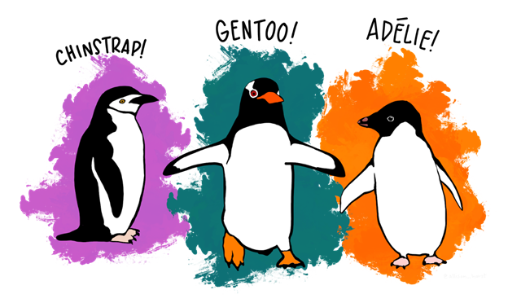
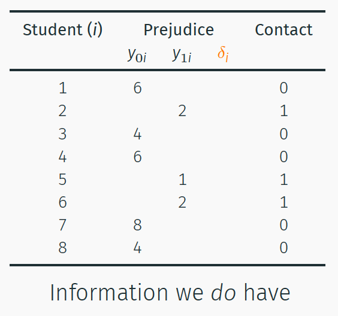
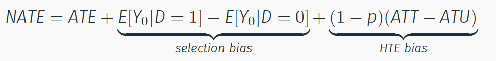

```{r setup, include=FALSE}
library(learnr)
library(palmerpenguins)
library(magrittr)
library(dplyr)
library(readr)
prejudice_df <- readr::read_csv("data/prejudice.csv")
tutorial_options(exercise.timelimit = 10)
knitr::opts_chunk$set(echo = FALSE)
```


## Introduction

###  Welcome!

Welcome to our second tutorial for the Statistics II: Statistical Modeling & Causal Inference (with R) course. 

The labs are designed to reinforce the material covered during the lectures by introducing you to hands-on applications. 

The practical nature of our class means that our labs will be data-centered. Throughout our class, we will get acquinted with multiple packages of the `tidyverse`. 

Though we expect that some of you may already know them, the `tidyverse` is a collection of R packages that share an underlying design, syntax, and structure. They will definitely make your life easier!!

Today, we will start with a brief introduction to data manipulation through the `dplyr` package. 

In this tutorial, you will learn to:

* identify the purpose of a set of `dplyr` verbs
* write statements in **tidy** syntax
* apply `dplyr` verbs to solve your data manipulation challenges

This tutorial is partly based on [_R for Data Science_](http://r4ds.had.co.nz/), section 5.2, and [_Quantitative Politics with R_](http://qpolr.com/data.html/), chapter 3.


### What we will need today

We'll practice some wrangling in `dplyr` using data for penguin sizes recorded by Dr. Kristen Gorman and others at several islands in the Palmer Archipelago, Antarctica. Data are originally published in: Gorman KB, Williams TD, Fraser WR (2014) PLoS ONE 9(3): e90081. doi:10.1371/journal.pone.0090081

You do **not** need to import the data to work through this tutorial - the data are already here waiting behind the scenes.

But if you *do* ever want to use the penguins data outside of this tutorial, they now exist in the [**palmerpenguins**](https://github.com/allisonhorst/palmerpenguins) package in *R*.

If you are ready to begin, click on!


## Data Structure

### Tidy data

Generally, we will encounter data in a tidy format. Tidy data refers to a way of mapping the structure of a data set. In a tidy data set:

1. Each variable forms a column.
2. Each observation forms a row.
3. Each type of observational unit forms a table

```{r, fig.align='center', echo=F, out.width = "70%"}
knitr::include_graphics("images/tidy_data.png")
```

### The `penguins` data set

The 3 species of penguins in this data set are Adelie, Chinstrap and Gentoo. The data set contains 8 variables: 

- **species:** a factor denoting the penguin species (Adelie, Chinstrap, or Gentoo)
- **island:** a factor denoting the island (in Palmer Archipelago, Antarctica) where observed
- **culmen_length_mm:** a number denoting length of the dorsal ridge of penguin bill (millimeters)
- **culmen_depth_mm:** a number denoting the depth of the penguin bill (millimeters)
- **flipper_length_mm:** an integer denoting penguin flipper length (millimeters)
- **body_mass_g:** an integer denoting penguin body mass (grams)
- **sex:** a factor denoting penguin sex (MALE, FEMALE)
- **year** an integer denoting the year of the record


```{r, fig.align='center', echo=F, out.width = "70%"}

```

<p style="text-align:right;">*Illustration by \@allisonhorst*</p>

### Let's explore the data set.

`head()` is a function that returns the first couple rows from a data frame. Write the R code required to explore the first observations of the `penguins` data set:

Notice that when you press 'Run', the **output** of the code is returned below it! So by pressing 'Run', you've run your first *R* code of the class!

```{r head, exercise=TRUE, exercise.lines = 1}
head(penguins)
```

## Manipulating with `dplyr`

### What we will learn today

In this tutorial, you'll learn and practice examples using some functions in `dplyr` to work with data. Those are: 

- `select()`: keep or exclude some columns
- `filter()`: keep rows that satisfy your conditions
- `mutate()`: add columns from existing data or edit existing columns
- `group_by()`: lets you define groups within your data set
- `summarize()`: get summary statistics
- `arrange()`: reorders the rows according to single or multiple variables


Let's get to work.

## `select()`

The first verb (function) we will utilize is `select()`. We can employ it to manipulate our data based on columns. If you recall from our initial exploration of the data set there were eight variables attached to every observation. Do you recall them? If you do not, there is no problem. You can utilize `names()` to retrieve the names of the variables in a data frame.

```{r names, exercise=TRUE, exercise.lines = 1}
names(penguins)
```

Say we are only interested in the species, island, and year variables of these data, we can utilize the following syntax:<p>
<center>
```select(data, columns)```
</center>
<br>

**Activity**
*The following code chunk would select the variables we need. Can you adapt it, so that we keep the body_mass_g and sex variables as well?*
```{r select-extra, exercise=TRUE, exercise.eval=TRUE, exercise.lines = 1}
dplyr::select(penguins, species, island, year)
```

```{r select-extra-hint}
# you just need to type the names of the columns
dplyr::select(penguins, species, island, year, body_mass_g, sex)
```

>To drop variables, use - before the variable name [i.e. select(penguins, -year)] to drop the year column

## `filter()`

The second verb (function) we will employ is `filter()`. `filter()` lets you use a logical test to extract specific rows from a data frame. To use `filter()`, pass it the data frame followed by one or more logical tests. `filter()` will return every row that passes each logical test.

The more commonly used logical operators are:

- `==`: Equal to
- `!=`: Not equal to
- `>`, `>=`: Greater than, greater than or equal to
- `<`, `<=`: Less than, less than or equal to
- `&`, `|`: And, or

Say we are interested in retrieving the observations from the year 2007. We would do:

```{r filter-extra, exercise=TRUE, exercise.eval=TRUE, exercise.lines = 1}
dplyr::filter(penguins, year == 2007)
```

```{r filter-extra-hint}
# you just need to utilize & and type the logical operator for the species
dplyr::filter(penguins, year == 2007 & species == "Chinstrap")
```

**Activity**
*Can you adapt the code to retrieve all the observations of Chinstrap penguins from 2007 (remember that species contains character units)* 

## The Pipe Operator: `%>%`

The pipe, `%>%`, comes from the `magrittr` package by Stefan Milton Bache. Packages in the tidyverse load `%>%` for you automatically, so you don’t usually load magrittr explicitly. This will be one of your best friends in *R*. 

> Pipes are a powerful tool for clearly expressing a sequence of multiple operations. Let's think about baking for a second.

<center>

</center>

**Activity**
*We can leverage the pipe operator to sequence our code in a logical manner. Can you adapt the following code chunck with the pipe and conditional logical operators we discussed?*

```
only_2009 <- dplyr::filter(penguins, year == 2009)
only_2009_chinstraps <- dplyr::filter(only_2009, species == "Chinstrap")
only_2009_chinstraps_species_sex_year <- dplyr::select(only_2009_chinstraps, species, sex, year)
final_df <- only_2009_chinstraps_species_sex_year
final_df #to print it in our console
```

```{r pipe-extra, exercise=TRUE, exercise.lines = 5}
penguins
```

```{r pipe-extra-hint}
penguins %>%
  dplyr::filter(year == 2009 & species == "Chinstrap") %>%
  dplyr::select(species, sex, year)
```

## `mutate()`

`mutate()` lets us create, modify, and delete columns. The most common use for now will be to create new variables based on existing ones. Say we are working with a U.S. American client and they feel more confortable with assessing the weight of the penguins in pounds. We would utilize `mutate()` as such:

<p>
<center>
```mutate(new_var_name = conditions)```</center><br>

```{r mutate-extra, exercise=TRUE, exercise.lines = 3}
penguins %>%
  dplyr::mutate(body_mass_lbs = body_mass_g/453.6)
```

```{r mutate-extra-hint}
penguins %>%
  dplyr::mutate(body_mass_kg = body_mass_g/1000)
```

**Activity**
*Can you edit the previous code chunk to render a new variable body_mass_kg?*

## `group_by()` and `summarize()`

These two verbs `group_by()` and `summarize()` tend to go together. When combined , 'summarize()` will create a new data frame. It will have one (or more) rows for each combination of grouping variables; if there are no grouping variables, the output will have a single row summarising all observations in the input. For example:

```{r summarize-extra, exercise=TRUE, exercise.eval=TRUE, exercise.lines = 3}
# compare this output with the one under the hint tab
penguins %>%
  dplyr::summarize(heaviest_penguin = max(body_mass_g, na.rm = T)) #max() does not know how to deal with NAs very well
```

```{r summarize-extra-hint}
penguins %>%
  dplyr::group_by(species) %>%
  dplyr::summarize(heaviest_penguin = max(body_mass_g, na.rm = T))
```

**Activity**
*Can you get the weight of the lightest penguin of each species? You can use `min()`. What happens when in addition to species you also group by year `group_by(species, year)`?*


## `arrange()`
The `arrange()` verb is pretty self-explanatory. `arrange()` orders the rows of a data frame by the values of selected columns in ascending order. You can use the `desc()` argument inside to arrange in descending order. The following chunk arranges the data frame based on the length of the penguins' bill. You hint tab contains the code for the descending order alternative. 
<p>
<center>
```arrange(variable_of_interest)```
</center>
<br>
```{r arrange-extra, exercise=TRUE, exercise.eval=TRUE, exercise.lines = 3}
penguins %>%
  dplyr::arrange(bill_length_mm)
```

```{r arrange-extra-hint}
penguins %>%
  dplyr::arrange(desc(bill_length_mm))
```

**Activity**
*Can you create a data frame arranged by body_mass_g of the penguins observed in the "Dream" island?*

## Quiz

```{r quiz-extra, exercise=TRUE, exercise.lines = 5}
penguins
```

Here are some questions for you. Note that there are multiple ways to reach the same answer:

```{r quiz}
quiz(
  question("Which verb allows you to index columns?",
    answer("select()", correct = T),
    answer("filter()"),
    answer("summarize()"),
    answer("group_by()")
  ),
  question("Which verb allows you to index rows?",
    answer("filter()", correct = T),
    answer("select()"),
    answer("summarize()"),
    answer("arrange()")
  ),
  question("How long was the longest observed bill of a Gentoo penguin in 2008? (Use the console above)",
    answer("55.2"),
    answer("53.4"),
    answer("51.5"),
    answer("54.3", correct = TRUE)
  ),
  question("How long was the shortest observed bill of a Gentoo penguin in 2008? (Use the console above)",
    answer("43.2"),
    answer("45.4"),
    answer("42.6", correct = TRUE),
    answer("45.3")
  )
)
```


## The Potential Outcomes Framework

Let's revisit the example from the lecture once again. Say we are interested in assessing the premise of Allport's hypothesis about interpersonal contact being conducive to reducing intergroup prejudice. We are studying a set of ($n=8$) students assigned to a dorm room with a person from their own ethnic group **(contact=0)** and from a different group **(contact=1)**.

| Student (i) | Prejudice (C=0) | Prejudice (C=1) |
|:-----------:|:---------------:|:---------------:|
|      1      |        6        |        5        |
|      2      |        4        |        2        |
|      3      |        4        |        4        |
|      4      |        6        |        7        |
|      5      |        3        |        1        |
|      6      |        2        |        2        |
|      7      |        8        |        7        |
|      8      |        4        |        5        |

**The data are already pre-loaded in the `prejudice_df` object**

### Data set

Today we will work with the `prejudice_df`. The data frame contains the following four variables:

- `student_id`: numeric student identification 
- `prej_0`: prejudice level under $Y_{0i}$ (Contact=0)
- `prej_1`: prejudice level under $Y_{1i}$ (Contact=1)
- `dorm_type`: binary for actual treatment state

```{r start, exercise=TRUE, exercise.lines = 1, exercise.eval=TRUE}
prejudice_df
```


## Treatment Effects

### Individual Treatment Effect (ITE)

We assume from the *potential outcomes framework* that each subject has a **potential outcome** under both treatment states. Let's take the first student in the list as an example. 


```{r, echo=FALSE, out.width="65%", fig.align = "center"}
  
```

The figure illustrates the **potential outcomes** for *Student 1*. 

We see that in a reality where *Student 1* is assigned to in-group dorm **(contact=0)** their levels of prejudice are *6*. On the contrary, in a reality where *Student 1* is assigned to co-ethnic dorm **(contact=1)** their levels of prejudice are *5*.

From this illustration, we can gather the **individual treatment effect (ITE)** for student one. The **ITE** is equal to the values under treatment *(contact=1)* minus to the values without treatment *(contact=0)* or $ITE = y_{1i} - y_{0i}$.

$$ITE = 5 - 6 = -1$$ 

As it was put in Cunningham's book:

>The ITE is a “comparison of two states of the world”
(Cunningham, 2021): individuals are exposed to contact, and
not exposed to it.

Evidently, each subject can only be observed in one treatment state at any point in time in real life. This is known as the **fundamental problem** (Holland, 1986) of causal inference. **The Individual Treatment Effect (ITE) in reality is unattainable.** Still, it provides us with a conceptual foundation for causal estimation.

**Exercise:** *Our data are coming from a world with perfect information. In that sense, we have both potential outcomes `prej_0` and `prej_1`. Can you think of a way to calculate the* **ITE** *for the eight students with one of the `dplyr` verbs we learned earlier today?*

```{r ite, exercise=TRUE, exercise.eval=TRUE,  exercise.lines = 3}
prejudice_df
```

```{r ite-hint}
#you can employ dplyr::mutate() to create the new variable ite
prejudice_df %>% 
  dplyr::mutate(ite = prej_1 - prej_0)
```


---

### Average Treatment Effect (ATE)

Normally, we are not interested in the estimates of individual subjects, but rather a population. The **Average Treatment Effect (ATE)** is the difference in the average potential outcomes of the population.

$$ATE = E(Y_{1i}) - E(Y_{0i})$$

In other words, the **ATE** is the average **ITE** of all the subjects in the population. As you can see, **the ATE as defined in the formula is also not attainable**. Can you think why?

**Exercise:** *Since our data are coming from a world with perfect information. Can you think of a way to calculate the* **ATE** *for the eight students based on what we learned earlier today?*

```{r ate, exercise=TRUE, exercise.eval=TRUE,  exercise.lines = 3}
prejudice_df
```

```{r ate-hint}
#we know that the ATE is the averge of every subject's ITE. Do you remember dplyr::summarize()?
#how can we use the verbs from earlier today to get the average treatment effect?
#we know that the ATE is the averge of every subject's ITE. Do you remember dplyr::summarize()?
#how can we use the verbs from last week to get the average treatment effect?
prejudice_df %>%
  dplyr::mutate(ite = prej_1 - prej_0) %>%
  dplyr::summarize(ate=mean(ite))
```

---

### The Average Treatment Effect Among the Treated and Control (ATT) and (ATC)

The names for these two estimates are very self-explanatory. These two estimates are simply the average treatment effects conditional on the group subjects are assigned to.

The average treatment effect on the treated **ATT** is defined as the difference in the average potential outcomes for those subjects who were treated:
$$ATT = E(Y_{1i}-Y_{0i} | D = 1)$$

The average treatment effect on the untreated **ATC** is defined as the difference in the average potential outcomes for those subjects who were not treated:
$$ATC = E(Y_{1i}-Y_{0i} | D = 0)$$

**Exercise:** *Since our data are coming from a world with perfect information. Can you think of a way to calculate the* **ATT** *and* **ATC** *for the eight students based on what we learned earlier today?*

```{r attatu, exercise=TRUE, exercise.eval=TRUE,  exercise.lines = 4}
prejudice_df
```

```{r attatu-hint}
#we know that the ATT and ATC are the average of every subject's ITE grouped by their treatment status. Do you remember how the combination of dplyr::group_by() and dplyr::summarize() worked?
#how can we use the verbs from earlier today to get the average treatment effect on the treated and untreated?

prejudice_df %>%
  dplyr::mutate(ite = prej_1 - prej_0) %>%
  dplyr::group_by(dorm_type) %>%
  dplyr::summarize(treatment_effects=mean(ite))
```

*What do you think these treatment group differences tell us?*

---

### The Naive Average Treatment Effect (NATE)

So far, we have worked with perfect information. Still, we know that in reality we can only observe subjects in one treatment state. This is the information we **do** have.

```{r, echo=FALSE, out.width="65%", fig.align = "center"}
  
```

The **Naive Average Treatment Effect (NATE)** is the calculation we can compute based on the observed outcomes.

$$NATE = E(Y_{1i}|D{i}=1) - E(Y_{0i}|D{i}=0)$$
\**reads in English as: "The expected average outcome under treatment for those treated minus the expected average outcome under control for those not treated"*

**Exercise:** *Can you think of a way to calculate the* **NATE** *for the eight students employing the new `observed_prej` variable?*

```{r nate, exercise=TRUE, exercise.eval=TRUE,  exercise.lines = 4}
prejudice_df %>%
  dplyr::mutate(observed_prej = ifelse(dorm_type == 1, prej_1, prej_0))
```

```{r nate-hint}
#we know that the NATE is the difference in average observed outcomes grouped by their treatment status. Do you remember how the combination of dplyr::group_by() and dplyr::summarize() worked?

prejudice_df %>%
  dplyr::mutate(observed_prej = ifelse(dorm_type == 1, prej_1, prej_0)) %>%
  dplyr::group_by(dorm_type) %>%
  dplyr::summarize(nate=mean(observed_prej))
```

---

*Note.* The ìfelse() function is a very handy tool to have. It allows us to generate conditional statements. The syntax is the following:

```r
ifelse(condition_to_meet, what_to_do_if_met, what_to_do_if_not_met)
```

*In the case of `observed_prej`, we ask* **R** *to create a new variable, where if the subject is in a co-ethnic dorm, we print the prejudice value under treatment. If that condition is not met, we print the prejudice value under control.*

## Bias

### Bias

During the lecture, we met two sources of bias:

```{r, echo=FALSE, out.width="65%", fig.align = "center"}
  
```

### Baseline bias

The baseline, also known as selection bias, is the difference in expected outcomes in the absence of treatment for the actual treatment and control group. In other words, these are the underlying differences that individuals in either group start off with.

### Differential treatment effect bias

Differential Treatment Effect bias is the difference in returns to treatment (the treatment effect) between the treatment and control group, multiplied by the share of the population in control. In other words, this type of bias relates to the dissimilarities stemming for ways in which individuals in either group are affected differently by the treatment. 

**Exercise:** *Since our data are coming from a world with perfect information. Can you think of a way to explore the existence* **baseline bias** *in our data?*

```{r sel-bias, exercise=TRUE, exercise.eval=TRUE,  exercise.lines = 4}
prejudice_df
```

```{r sel-bias-hint}
#we know that the baseline bias is the difference in average observed outcomes under control grouped by their treatment status. Do you remember how the combination of dplyr::group_by() and dplyr::summarize() worked?
```

**Exercise:** *Since our data are coming from a world with perfect information. Can you think of a way to explore the existence* **differential treatment effect bias** *in our data?*

```{r hte-bias, exercise=TRUE, exercise.eval=TRUE,  exercise.lines = 4}
prejudice_df
```

```{r hte-bias-hint}
#we know that the differential treatment effect bias is the difference in difference in the average of every subject's ITE grouped by their treatment status (or the difference between ATT and ATCs). 
#Maybe you can go back an check how to get the average treatment effect on the treated and untreated
```

## Quiz

```{r install-packages, echo=FALSE}
question("To prevent problems during the knitting process, where should you run code to install packages?",
  answer("R Console", correct = TRUE),
  answer("Script Editor"),
  answer("Environment"),
  answer("Output Panel"),
  random_answer_order = TRUE)
```

```{r plausible_estimates, echo=FALSE}
question("Which of the following effects can we observe in reality?",
  answer("Naive Average Treatment Effect (NATE)", correct = TRUE),
  answer("Average Treatment Effect on the Treated (ATT)"),
  answer("Average Treatment Effect (ATE)"),
  answer("Average Treatment Effect on the Control (ATC)"),
  random_answer_order = TRUE)
```

```{r ate-q, echo=FALSE}
question("Mark all that are true. The Average Treatment Effect (ATE) is:",
  answer("equal to the Naive Average Treatment Effect (NATE) in the absence of bias", correct = TRUE),
  answer("the average of everyone's Individual Treatment Effect (ITE)", correct = TRUE),
  answer("the difference between the observed effects of treated units"),
  answer("the difference in the average potential outcomes of the population", correct = TRUE),
  random_answer_order = TRUE)
```
